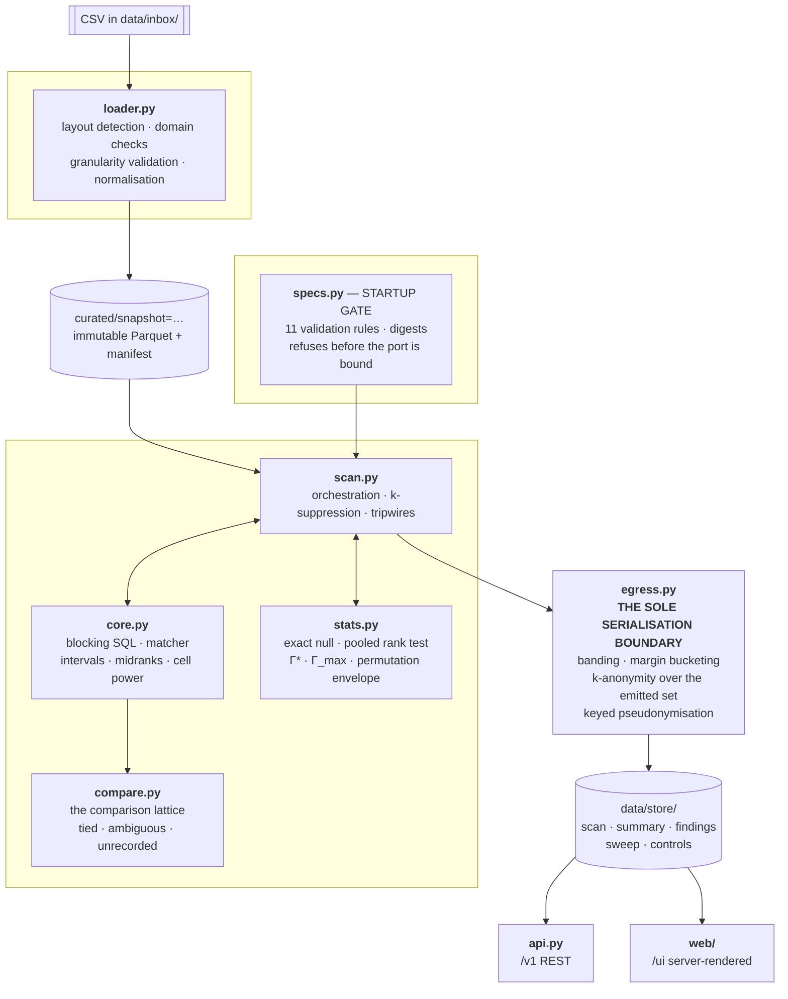

# Pipeline and API

How data moves through the system, what each engine is responsible for, and what the API
surface looks like from outside.

| | |
| :--- | :--- |
| Document | Pipeline reference |
| Product | Likewise |
| Author | Arun Kadambi |
| Date | 9 September 2026 |

---

## 1. The shape of it

One process. No database server, no message queue, no cache, no object store, no cloud
account. Data enters as a CSV file and leaves as JSON or HTML, and everything in between is
one Python process with an embedded columnar engine.



If Mermaid does not render for you, the same thing as text:

```
   CSV in data/inbox/
          │
          ▼
   ┌──────────────────────┐
   │  loader.py           │  layout detection, domain and granularity
   │  (streaming, in SQL) │  validation, normalisation → Parquet
   └──────────┬───────────┘
              │  immutable snapshot prefix + manifest
              ▼
   ┌──────────────────────┐
   │  specs.py            │  load, validate (11 rules), digest,
   │  STARTUP GATE        │  refuse before binding the port
   └──────────┬───────────┘
              ▼
   ┌──────────────────────┐    ┌────────────────┐
   │  scan.py             │◀──▶│  core.py       │  blocking SQL, matcher,
   │  orchestration       │    │    └ compare.py│  intervals, lattice, midranks
   │  suppression         │    ├────────────────┤
   │  tripwires           │◀──▶│  stats.py      │  exact null, pooled test,
   └──────────┬───────────┘    │                │  Γ*, Γ_max, envelope
              │                └────────────────┘
              ▼
   ┌──────────────────────┐
   │  egress.py           │  THE SOLE SERIALISATION BOUNDARY
   │  banding, bucketing  │  k-anonymity over the emitted attribute set
   │  pseudonymisation    │
   └──────────┬───────────┘
              │
       ┌──────┴───────┐
       ▼              ▼
  api.py  /v1    web/  /ui
```

## 2. What each engine is responsible for

| Module | Owns | Explicitly does not own |
| :--- | :--- | :--- |
| `loader.py` | Reading CSV, detecting which of three layouts it is, validating domains and publication granularity, normalising to the internal schema, writing Parquet and a manifest | Any judgment about comparability. It refuses or it loads |
| `specs.py` | Loading, validating and digesting the comparability standard; the startup gate; the per-pair resolution threshold | Deciding anything about a pair. It supplies thresholds |
| `core.py` | Blocking SQL, candidate generation, the matcher, interval construction, midranks, cell power | Orchestration, suppression, statistics |
| `compare.py` | Placing one pair on the comparison lattice for one dimension | The finding rule. That quantifies over comparisons and lives in the specification |
| `precedent.py` | Admission when a prior decision governs: the status ladder, the abstention causes | Disposing of a case. It surfaces a controlling precedent and stops |
| `binding_gate.py` | Scoring rulings against a corpus oracle: the verdict taxonomy, the exact false-bind bound, the guard and independence arms | Producing rulings. It is handed decisions and grades them |
| `stats.py` | The exact null, the pooled stratified rank test, sensitivity bounds, the permutation envelope | Anything that touches records. It sees values and labels |
| `scan.py` | Sequencing the run, k-suppression, tripwire evaluation, assembling the summary | Comparison logic. It calls `core` and `stats` |
| `egress.py` | Every value that leaves the process | Computing anything. It bands, buckets, pseudonymises and refuses |
| `api.py` | Routes, authentication, error mapping | Business logic. It reads stored post-egress artifacts |
| `web/` | Rendering stored post-egress artifacts | It never sees a raw `Finding` |
| `store.py` | `get` / `put` / `create` / `list` / `uri` | Anything conditional except `create` |
| `paths.py` | Where mutable things live, resolved from the environment | — |
| `runtime.py` | Engine memory and thread budget, from the environment | — |

## 3. The pipeline in order

### Ingest

Conversion happens **inside DuckDB**, as a projection over a CSV scan, not in Python, so
memory does not scale with the file. `convert()` in `loader.py` is the same mapping written
as plain Python and kept as the readable reference; a differential test drives both over
real files and asserts identical records including record-key digests, so the fast path
cannot drift from the legible one.

Three layouts are recognised from the header row alone:

| Layout | Distinguishing columns | Income unit |
| :--- | :--- | :--- |
| FFIEC Snapshot (national) | `combined_loan_to_value_ratio`, `denial_reason_1` | **thousands** |
| FFIEC Data Browser export | `loan_to_value_ratio`, `denial_reason-1` | dollars |
| Template | internal names | dollars |

The unit difference is exactly the kind of thing that produces a plausible wrong answer, so
it is part of layout detection rather than a downstream correction.

**Dropped at ingest, not filtered downstream:** census tract. No intermediate Parquet can
carry it, and a test greps every curated schema for the field.

**Refuses rather than repairs:** ragged rows (never padded — a shifted column is exactly what
that catches), codes outside their published domain, more than one filer or filing year in a
snapshot, and values not at publication granularity.

### Startup gate

Eleven validation rules, checked before the port is bound. A failure exits non-zero with a
structured payload.

| Rule | Requirement |
| :--- | :--- |
| 1 | Every dimension named by a testable reason code resolves to a granularity and a tolerance |
| 1b | No protected-class field appears in the key or the feature sets |
| 2 | Every referenced budget entry exists |
| 3 | Tolerance is **strictly** greater than granularity |
| 4 | The blocking key is a subset of the exact-match set |
| 5 | Every banded field is a control feature or residual-risk dimension, and the band covers the matcher tolerance on both terms |
| 6 | Disclosure floor: `k_min ≥ 5`, geography ceiling is the county |
| 7 | Every tolerance carries a written rationale |
| 8 | A tested dimension may not appear in the key, the exact-match set or the bands |
| 9 | A residual-risk band is strictly wider than its own tolerance |
| 10 | A tolerance is below its dimension's own declared span, so the dimension still participates |
| 11 | A banded relative tolerance declares its reference side, and it is `min` |

Rules 8 and 9 arrived with specification 1.4.0; rules 10 and 11 followed from the
precedence review. Rule 10 refuses a tolerance at or above its dimension's span — that
switches the dimension off rather than loosening it. Rule 11 exists because rule 5
compares band and tolerance as scalar coefficients, which is sound only when the
tolerance is referenced to the smaller magnitude; `reference` was read from YAML and
never validated. Both invariants held before that by
inspection; neither was checked, which is the same shape as every defect the gate exists to
catch. A gate nobody has watched fail is a gate nobody has tested, so there is a CI fixture
that deliberately violates each rule and asserts the refusal.

### Scan

```
blocking → candidates → matcher → reason engine → dominance
        → cells and midranks → k-suppression → statistics → egress
```

Candidates are generated by a value-range band on the sort key rather than a positional
window, with the record key as the final sort term — the leading sort field is published at
bin midpoint and therefore heavily tied, and a positional window over an unstable sort
produced a candidate set that varied between runs.

**Null matching is prohibited unconditionally.** `IS NOT DISTINCT FROM` is banned by a lint
test rather than by a maintained list of susceptible fields, because a maintained list
drifts. The same rule holds in Python: the resubmission signature once compared null equal
to null and silently dropped pairs from every denominator but its own.

**k-suppression happens before ranking**, and k-anonymity is computed over the **emitted**
attribute set. k-anonymity over a coarser set than what you publish is not k-anonymity.

### Egress

**All external serialisation of `Finding`, `Summary`, `ControlResult` or `NullSummary` passes
through `egress.py`.** No other module may construct a JSON response, an HTTP body, an
export file or a log line containing those types.

Enforced, not requested: a contract test walks every registered route; a static check fails
the build on a direct import of a raw dataclass into a renderer; a serialiser test asserts
no response exposes a raw institution identifier, a census tract, a record key or a
per-application raw value.

The leak that motivated the current form passed the original test — the exact margin was
published at six decimal places beside four banded quasi-identifiers, and the test checked
*key names*. A near-unique pair identifier is not a key name.

## 4. API surface

Base `/v1`, RFC 7807 error bodies. **Every route except `/health` requires a per-principal
bearer credential** — reads included.

| Method | Path | Scope | Notes |
| :--- | :--- | :--- | :--- |
| GET | `/health` | — | Liveness plus the loaded specification digests |
| GET | `/v1/specs/{kind}` | read | The standard in force, retrievable |
| POST | `/v1/scans` | write | Idempotent on the input tuple |
| POST | `/v1/scans/{id}/execute` | write | Synchronous |
| GET | `/v1/scans` | read | |
| GET | `/v1/scans/{id}` | read | |
| GET | `/v1/scans/{id}/findings` | read | **409 without a sweep** |
| GET | `/v1/scans/{id}/controls` | read | |
| GET | `/v1/scans/{id}/null` | read | |
| GET | `/v1/scans/{id}/sweep` | read | |
| POST | `/v1/pairs/evaluate` | write | Rejects institution identifiers |

Three of these carry a design decision worth knowing:

**`/controls` and `/null` are product outputs, not analysis artifacts.** A rate is never
served without them — the findings route carries the null summary in its envelope.

**Findings are not servable without a sweep.** A result may not be presented without the
curve showing whether its threshold was chosen to produce it. There is no bypass flag.

**`/pairs/evaluate` rejects institution identifiers rather than redacting them.** Redacting
caller-supplied input would make the endpoint an oracle over its own pseudonymisation
function — the filer panel is public and enumerable, so a complete mask-to-identifier table
would be buildable in about an hour. Input is restricted to an allowlist of published fields
at published precision; anything else is a 422, and request bodies are excluded from logs.

### Web routes

`/ui` is server-rendered over the **same stored post-egress artifacts the API serves**.

| Route | Shows |
| :--- | :--- |
| `/ui/scans` | Snapshots and scans, each labelled real or fixture |
| `/ui/scans/{id}/coverage` | The denominator chain and the coverage profile |
| `/ui/scans/{id}/queue` | The prioritised review queue |
| `/ui/scans/{id}/findings/{fid}` | One pair, with disposition capture |
| `/ui/scans/{id}/sweep` | The exceedance curve |
| `/ui/scans/{id}/controls` | The placebo comparison |
| `/ui/spec` | The comparability standard in force |

The session cookie carries the **same** bearer credential the API takes. That is the whole
of the web view's authentication surface: no second signing key, no second trust root, one
place to revoke.

## 5. The denominator chain

Every scan publishes this as an ordered, required list. Every element is present or the
summary is invalid.

```
records_in_scope
  → denials_in_scope
  → denials_non_exempt                   (denials_exempt_excluded)
  → denials_complete                     (excluded_incomplete_records)
  → denials_with_matched_comparator      (same_applicant_routed, suppressed_k)
  → denials_testable_by_code
  → denials_in_adequately_powered_cell   (cells_underpowered)
  → denials_with_dominating_comparator
  → denials_with_finding
```

Each row states **its own** denominator. Testability is a property of the stated reason
code, not of whether the denial matched, so it is also reported as a marginal over all
denials in scope. Chaining the two as if each nested inside the last produces a share above
100% and a bar that lies.

`denials_incomparable` is reported alongside: denials whose tested dimension the published
record cannot order at all. That is a statement about the data, not an absence of a result.

## 6. Gates that will stop a run

| Gate | Where | What it protects |
| :--- | :--- | :--- |
| Startup gate | `specs.py` | Eleven rules. Exits before binding the port |
| Unsigned specification | `specs.py` | A service may not serve a spec with no named author. Historical versions stay loadable for replay |
| Publication granularity | `loader.py` | Data not at the regulator's coarsening |
| Row-count reconciliation | `loader.py` | Ragged rows, without trusting a reject table that does not materialise under a projection plan |
| Post-treatment diagnostic | `scan.py` | A matching field determined by the outcome. Refuses per field, with the diagnostic |
| SQL lint | test | `IS NOT DISTINCT FROM`, unconditionally |
| Path lint | test | Hardcoded mutable paths that work in a checkout and fail silently in a container |
| Egress contract | `egress.py` + test | Raw identifiers, tract, record keys, per-application values |
| Sweep guarantee | `api.py` + test | Findings without the threshold curve — 409 |
| Controls | `tools/run_controls.py` | Publication blocked if the placebo comparison fails |
| Tripwires | `scan.py` | Headline rates outside band, **in either direction**, including the scan-level statistic |
| Mutation gate | `tools/mutate.py` | Kill rate ≥ 0.90 on a published catalogue |

## 7. Reproducibility

`content_hash` is a canonical hash over sorted logical rows at fixed numeric precision. The
guarantee is **content identity, not byte identity** — Parquet byte-identity additionally
requires pinned writer and codec versions and single-threaded writes, and is broken by design
across deployments because the pseudonym key differs.

Scan identifiers derive from `(filer, year, specification version, snapshot)`, so the same
inputs always produce the same scan.

Stated plainly: a deterministic wrong answer reproduces perfectly. This is a reproducibility
property, not a quality result.
